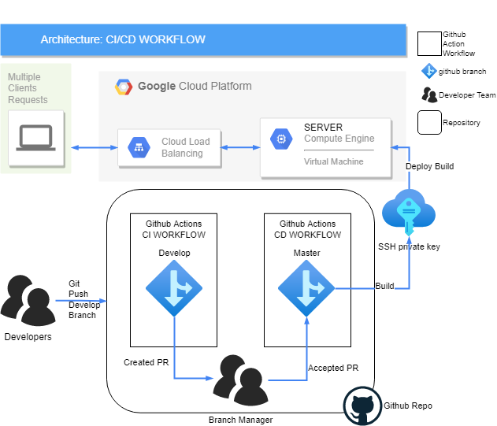

# Week 3 Scripts WEBPAGE DEVOPS

Architecture diagram for the workflow followed by github actions in the different stages of the CI/CD pipeline defined.

First of all we have the developers creating a new piece of code for the project and pushing those changes to the develop branch in a github repo after that automatically the workflow of the CI part triggers on changes in the develop branch and tries to test and build said changes with tests defined to verify the structure of an html page and if all goes well it creates a pull request in the master branch.

Continuing with the CD part we need the approval of the branch manager on the pull request created before hand for the incorporation of said changes in master. When is approved the workflow will trigger and it will run the necessary steps to make the deploy to the remote server in this case using a SSH private key that is saved in the repository like a secret for the safeguard of it.